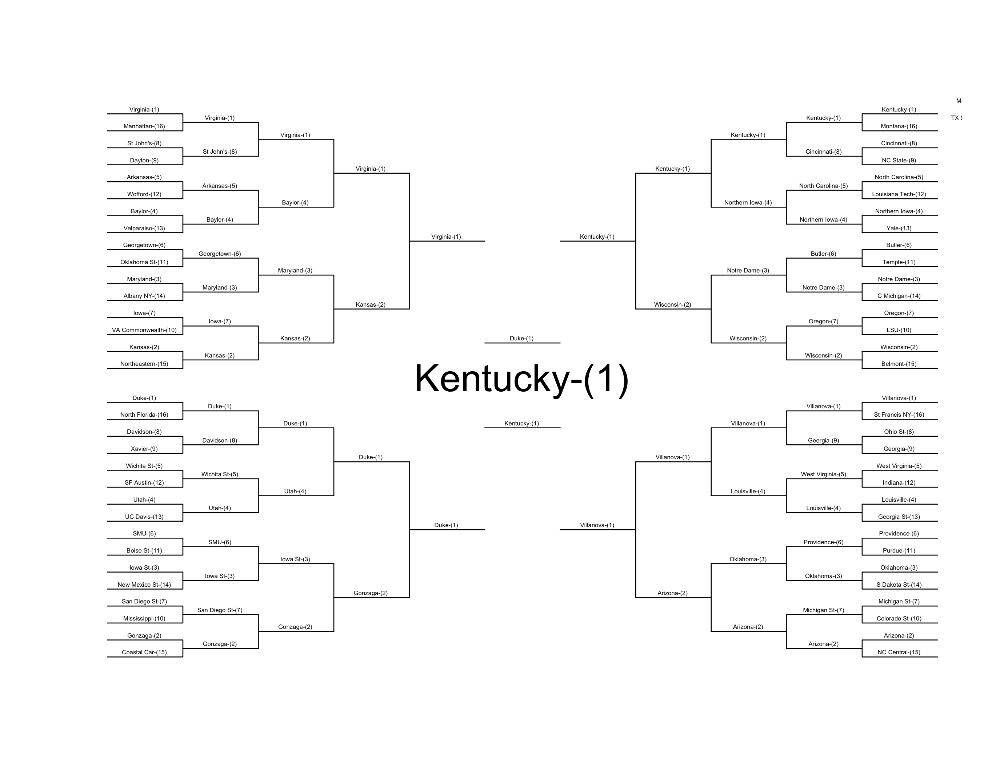

<!-- README.md is generated from README.Rmd. Please edit that file -->

[](https://travis-ci.org/zachmayer/kaggleNCAA) [](https://coveralls.io/r/zachmayer/kaggleNCAA?branch=master)

Kaggle NCAA Bracket Simulator
=============================

Simulate the NCAA tournament based on a kaggle-format bracket (with predictions for every possible matchup). Install the package with:

``` {.r}
devtools::install_github('zachmayer/kaggleNCAA')
```

    ## Downloading github repo zachmayer/kaggleNCAA@master
    ## Installing kaggleNCAA
    ## '/Library/Frameworks/R.framework/Resources/bin/R' --vanilla CMD INSTALL  \
    ##   '/private/var/folders/cn/s_ld8cnn5px9pkf47p_k5hb00000gp/T/RtmpeYTLLM/devtoolsd24f1460ca53/zachmayer-kaggleNCAA-7bcd610'  \
    ##   --library='/Library/Frameworks/R.framework/Versions/3.1/Resources/library'  \
    ##   --install-tests

``` {.r}
library('kaggleNCAA')
f <- system.file('kaggle_data/sample_submission_2015_prelim_seed.csv', package = "kaggleNCAA", mustWork=TRUE)
dat <- parseBracket(f)
sim <- simTourney(dat, 1000, year=2015, progress=TRUE)
bracket <- extractBracket(sim)
printableBracket(bracket)
```


