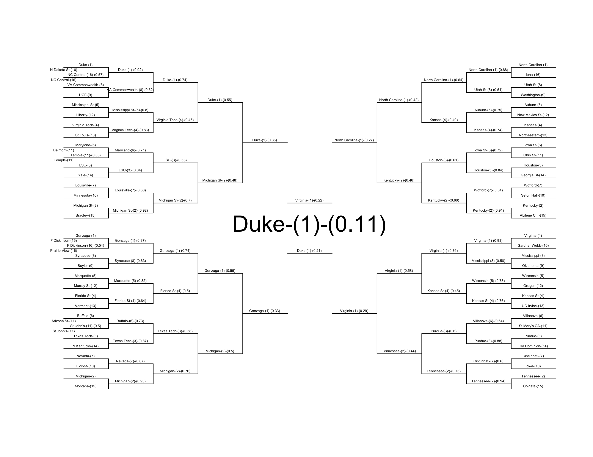

<!-- README.md is generated from README.Rmd. Please edit that file -->
[](https://travis-ci.org/zachmayer/kaggleNCAA) [](https://coveralls.io/r/zachmayer/kaggleNCAA?branch=master)

Kaggle NCAA Bracket Simulator
=============================

Simulate the NCAA tournament based on a kaggle-format bracket (with predictions for every possible matchup). Install the package with:

``` r
devtools::install_github('zachmayer/kaggleNCAA')
```

Then simulate a tournament and print a bracket:

``` r
set.seed(1)
library('kaggleNCAA')
data(sample_submission_men)
f <- tempfile()
write.csv(sample_submission_men, f, row.names=F)
dat <- parseBracket(f)
#> Assuming men's bracket
unlink(f)
sim <- simTourney(dat, 100, year=2018, progress=TRUE)
#> assuming women = 0
bracket <- extractBracket(sim)
printableBracket(bracket)
#> assuming women = 0
```

 If simulation's not your thing (e.g. your predicted probabilities are transitive), you can also "walk" forward through the tournament, which is much faster:

``` r
bracket <- walkTourney(dat, year=2018)
printableBracket(bracket)
#> assuming women = 0
```

 Note in this case that the probabilities associated with the team making it to a given round will be incorrect
